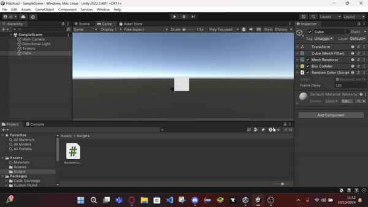
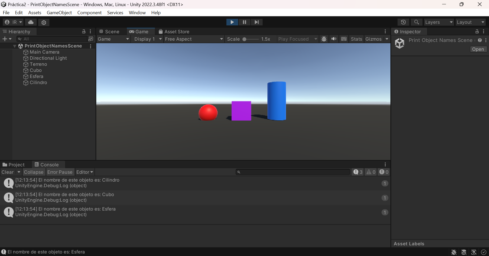
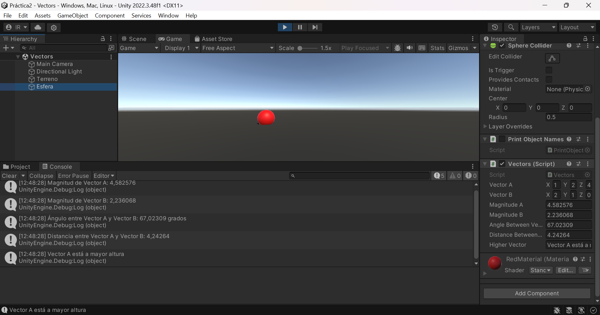
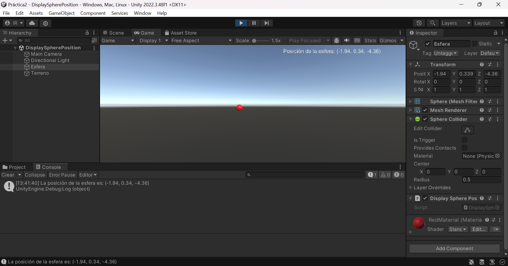
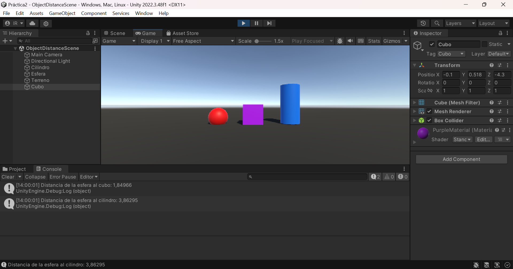
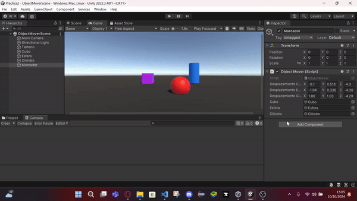
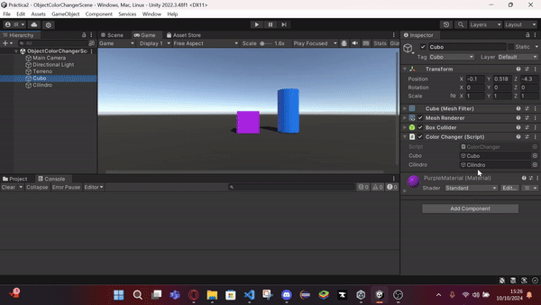
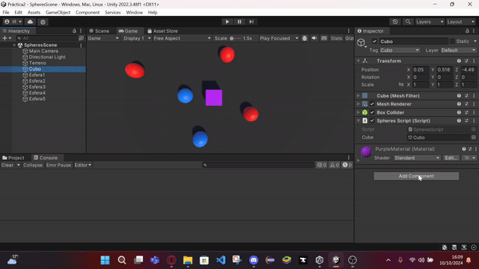

# introduccionCSharp-Scripts - Ejercicios

Este proyecto incluye 8 ejercicios prácticos resueltos en Unity, donde se exploran conceptos como la manipulación de GameObjects, uso de scripts en C#, interacción con el teclado y gestión de materiales y transformaciones. A continuación, se presenta una breve descripción de cada ejercicio.

---

## Ejercicio 1: Cambio de Color Aleatorio cada 120 Frames (RandomColor.cs)
**Descripción:**  
Este ejercicio consiste en crear un script que inicializa un vector de 3 posiciones (para el color RGB) con valores aleatorios entre 0.0 y 1.0. Cada 120 frames, el script selecciona una posición aleatoria del vector y actualiza el color del objeto. El número de frames de espera se puede modificar desde el inspector.

**Ejecución:**  

---

## Ejercicio 2: Creación de Escena con Objetos (PrintObjectNames.cs)
**Descripción:**  
En esta escena se ubican un plano, un cubo, una esfera y un cilindro, cada uno con un color diferente. Al ejecutarse, cada uno de estos objetos imprime su nombre en la consola.

**Ejecución:**  

---

## Ejercicio 3: Operaciones con Vectores en la Esfera (Vectors.cs)
**Descripción:**  
Se crea un script en la esfera que tiene dos variables `Vector3` públicas. Se muestran en la consola la magnitud de los vectores, el ángulo que forman entre sí, la distancia entre ellos, y qué vector tiene una mayor altura. Estos valores también se muestran en el inspector.

**Ejecución:**  

---

## Ejercicio 4: Mostrar la Posición de la Esfera en Pantalla (DisplaySpherePosition.cs)
**Descripción:**  
Se muestra en pantalla la posición de la esfera usando la función `OnGUI()`. El texto aparece en la esquina superior derecha y se actualiza en tiempo real.

**Ejecución:**  

---

## Ejercicio 5: Mostrar Distancia entre Esfera, Cubo y Cilindro (DistanceScript.cs)
**Descripción:**  
El script calcula y muestra en consola la distancia entre la esfera y los otros dos objetos (cubo y cilindro). Los objetos se buscan en la escena mediante su etiqueta y la distancia se calcula usando `Vector3.Distance()`.

**Ejecución:**  

---

## Ejercicio 6: Cambiar la Posición de los Objetos al Pulsar la Barra Espaciadora (ObjectMover.cs)
**Descripción:**  
Este ejercicio permite mover objetos a diferentes posiciones configuradas previamente en el inspector, en respuesta a la pulsación de la barra espaciadora. Cada objeto tiene un desplazamiento que se aplica respecto a su posición original.

**Ejecución:**  

---

## Ejercicio 7: Cambiar el Color de los Objetos al Pulsar Teclas (ColorChanger.cs)
**Descripción:**  
El script cambia el color del cilindro cuando se pulsa la tecla **C** y cambia el color del cubo cuando se presiona la flecha hacia arriba. Los colores asignados son aleatorios.

**Ejecución:**  

---

## Ejercicio 8: Manipulación de Esferas según Proximidad al Cubo (SpheresScript.cs)
**Descripción:**  
En esta escena hay esferas de tipo 1 y tipo 2. El script aumenta la altura de la esfera de tipo 2 más cercana al cubo y cambia el color de la esfera más lejana (sin importar su tipo) cuando se presiona la barra espaciadora.

**Ejecución:**  

